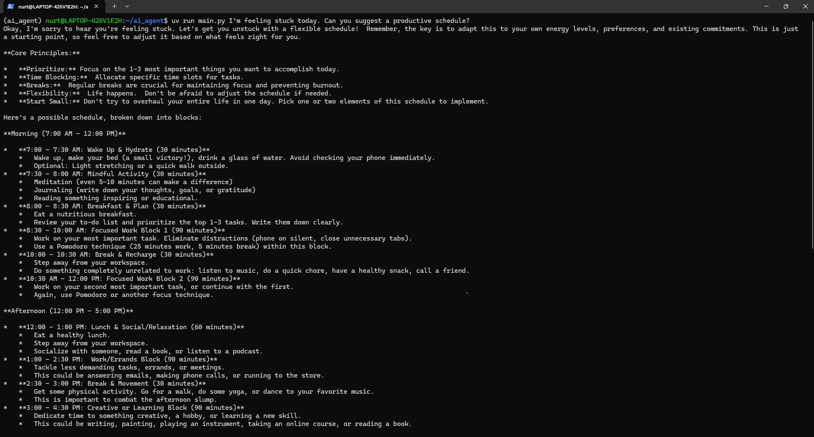

## General-Purpose AI desktop client

The purpose of this project is so that the user can extend the functionality of a given desktop tool with the ai
client. The latest snapshot shows the AI’s intuitive interaction with the system calendar tool. Take calendar as an
example of the accessed tool by the client. When you access the calendar through the client, you can extend the
features of the standalone calendar tool to your imagination. As an example of extending the core features of a tool, I could
prompt the AI to use system calendar as its data source and make a timetable for piano lessons and paste that into
an excel spreadsheet. Using reasoning and critical thinking, the AI will accomplish the example-task. I believe students,
teachers and employees may share a benefit from the desktop AI-client

#### Screenshots

